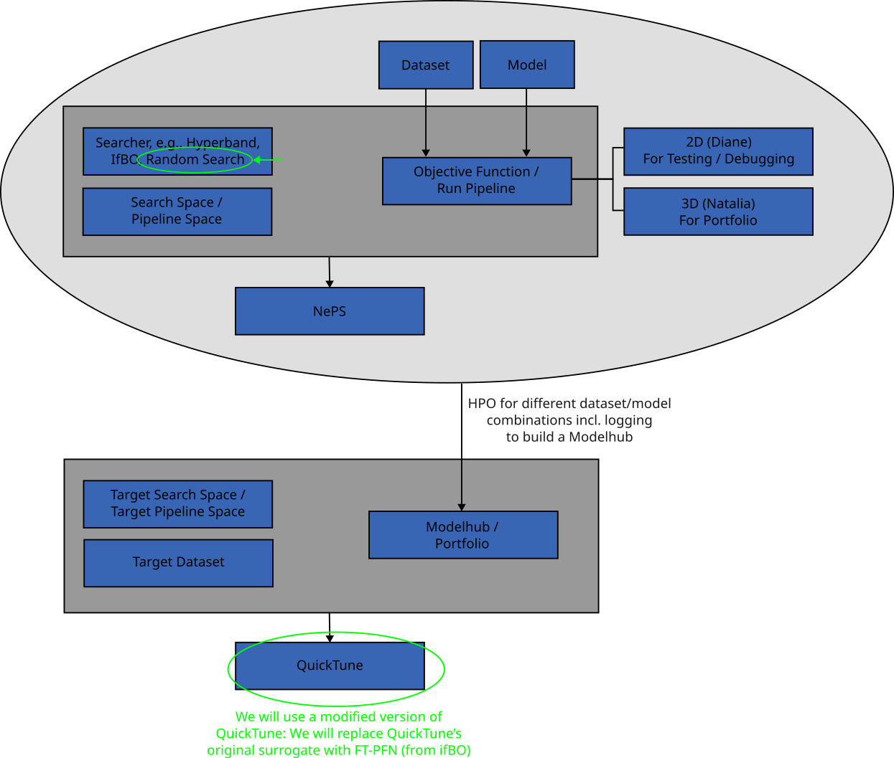

# MedQuickTune


## **Getting Started**

### **1. Set Up Python Environment**
You can choose either option A (Conda) or option B (venv):

#### Option A: Using Conda
Install Conda if you haven't already. Then create a new conda environment:

* On all platforms (Linux/macOS/Windows):
```bash
conda create --name medquicktune python=3.11
```

Activate the environment:
* On Linux/macOS:
```bash
conda activate medquicktune
```
* On Windows:
```cmd
activate medquicktune
```

#### Option B: Using venv
Create a Python virtual environment:
* On all platforms (Linux/macOS/Windows):
```bash
python -m venv medquicktune
```

Activate the environment:
* On Linux/macOS:
```bash
source medquicktune/bin/activate
```
* On Windows (Command Prompt):
```cmd
medquicktune\Scripts\activate.bat
```
* On Windows (PowerShell):
```powershell
medquicktune\Scripts\Activate.ps1
```

### **2. Install Required Tools**
#### Install ` Poetry` and project dependencies

`Poetry` is a tool for dependency management and packaging in Python that makes project setup consistent and easy.

Install `Poetry` using one of these methods based on your operating system:

* On Linux/macOS:
    ```bash
    curl -sSL https://install.python-poetry.org | python3 -
    ```

* On Windows (PowerShell):
    ```powershell
    (Invoke-WebRequest -Uri https://install.python-poetry.org -UseBasicParsing).Content | py -
    ```

* On Windows (Command Prompt):
    ```cmd
    python -c "(lambda u: __import__('urllib.request').request.urlretrieve(u, 'install-poetry.py') and __import__('subprocess').run(['python', 'install-poetry.py']))(r'https://install.python-poetry.org')"
    ```

After installing Poetry, install the project dependencies:
```bash
poetry install
```

### **3. Install `just`**
`just` is used to simplify task automation in this project. To install `just`, run:
* On Linux:
    ```bash
    sudo apt install just
    ```
* On macOS (with Homebrew):
    ```bash
    brew install just
    ```
* On Windows:
    Download the prebuilt binary from the [Just GitHub Releases](https://github.com/casey/just/releases) and add it to your PATH.

### **4. Download Datasets**
Use the following commands to download and set up the required datasets:
- **Download all datasets**:
    ```bash
    just download-datasets
    ```
    This will download and set up the complete datasets in the `datasets/` directory.
- **Download a mini version for testing**:
    ```bash
    just download-datasets-mini
    ```
    This will download a smaller subset of the datasets for quick testing and place them in the `datasets/mini/` directory.

## **Usage**

### Run a Test Experiment
Run a test experiment on the local machine:
```bash
just run-local-test DATASET=<dataset> EXPERIMENT_NAME=<name> SEED=<seed>
```

> **Example:**
> ```bash
> just run-local-test desmoid test_experiment 42
> ```

Submit a test experiment to the cluster:
```bash
just run-cluster-test DATASET=<dataset> EXPERIMENT_NAME=<name> SEED=<seed>
```

> **Example:**
> ```bash
> just run-cluster-test desmoidtest_experiment 42
> ```

> **Note:**  
> The workspace needs to be adjusted in the `justfile` and the bash scripts in the `cluster_scripts/` directory.
### Format Code
To format the code using `black` and `isort`:
```bash
just format
```

### Delete Test Experiments
To clean up all test experiments (experiments that name starts with `test_`):
```bash
just delete-tests
```

> **Note:**  
> This command will permanently remove all experiments with names starting with `test_` from your experiments directory. Make sure you don't have any important test data before running this command.

### More Commands
To explore additional `just` commands, you can list all available recipes and their descriptions by running:
```bash
just --list
```

This will show all available commands along with a brief description of what each command does.


## **Project Structure**
```
MEDQUICKTUNE
├── cluster_scripts/                # Bash scripts for submitting experiments to the cluster
│
├── configs/                        # YAML configuration files
│   ├── pipeline_spaces/            # Pipeline space configuration files (HPO)
│   └── main_experiment_config.yaml # Main experiment configuration file
│
├── datasets/                       # Directory for raw and processed datasets (requires downloading)
│   ├── <DATASET>/                  # Each dataset has its own directory
│   └── mini/                       # Mini version of datasets (for testing/debugging)
│    └── <DATASET>/                 # Each mini-dataset has its own directory
│
├── experiments/                    # Stores dataset-specific experiments, logs, and results
│   └──<DATASET>/                   # Experiments are grouped by dataset
│     └── <NAME>/                   # Experiment name
│       └── hydra_output/           # Hydra output directory
│       └── NePS_output/            # NePS output directory
│
├── reports/                        # Directory for analyses, plots, presentations, etc.
│   └── <REPORT>/                   # Each report has its own directory
│
├── shell_scripts/                  # Shell scripts for dataset downloading, formatting, and linting
│
├── src/                            # Main code of the project
│   ├── analysis/                   # Scripts for experiment analysis (e.g., plotting scripts)
│   ├── classification_2d/          # Code for 2D classification
│   │   ├── models_2d.py            # Code for model definitions    
│   │   ├── objective_function_2d.py    # Code for 2D run pipeline
│   │   ├── preprocess_data_2d.py       # Code for 2D data preprocessing
│   │   └── preprocess_work_labels.py   # Code for 2D WORC (dataset) label preprocessing
│   ├── classification_3d/          # Code for 3D classification
│   │   ├── models_3d.py            # Code for model definitions    
│   │   ├── objective_function_3d.py    # Code for 3D run pipeline
│   │   └── preprocess_data_3d.py       # Code for 3D data preprocessing
│   ├── utils/                      # Core utilities for model training, logging, checkpointing, and configuration management
│   ├── _init_.py                   # Empty file to make the directory a package
│   ├── test_best_config.py         # Evaluation script
│   └── train_neps.py               # Training script
│
└── ...
```
## **Contributing**
Contributions are welcome! To contribute:

- Fork the repository.
- Create a new branch for your feature/bugfix.
- Submit a pull request with a detailed explanation.


## **License**
This project is licensed under the MIT license.
