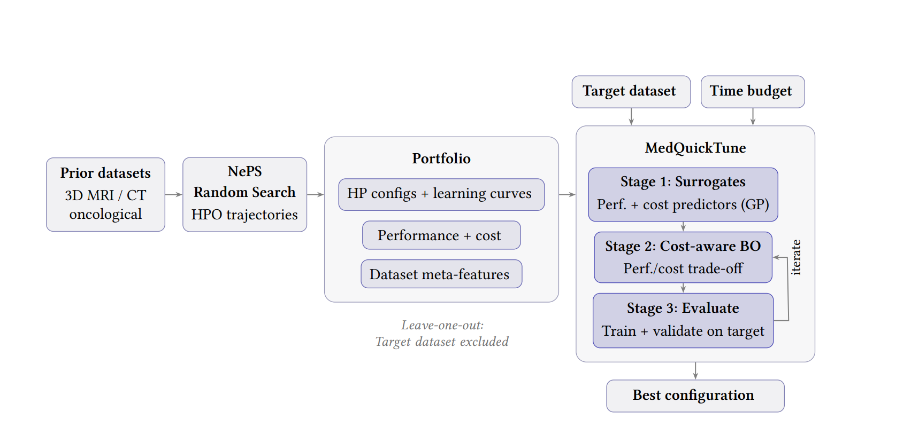

# MedQuickTune

Official implementation of **MedQuickTune: Portfolio-Based Meta-Learning for Efficient Hyperparameter Optimization in 3D Oncological Imaging**.

This repository contains the code, experiment scripts, portfolio construction pipeline, and evaluation utilities associated with the paper submitted to the AutoML Conference ABCD Track.



## **Getting Started**

### **1. Set Up Python Environment**
You can choose either option A (Conda) or option B (venv):

#### Option A: Using Conda
Install Conda if you haven't already. Then create a new conda environment:

* On all platforms (Linux/macOS/Windows):
```bash
conda create --name medquicktune python=3.11
```

Activate the environment:
* On Linux/macOS:
```bash
conda activate medquicktune
```
* On Windows:
```cmd
activate medquicktune
```

#### Option B: Using venv
Create a Python virtual environment:
* On all platforms (Linux/macOS/Windows):
```bash
python -m venv medquicktune
```

Activate the environment:
* On Linux/macOS:
```bash
source medquicktune/bin/activate
```
* On Windows (Command Prompt):
```cmd
medquicktune\Scripts\activate.bat
```
* On Windows (PowerShell):
```powershell
medquicktune\Scripts\Activate.ps1
```
### 2. Install Poetry and Project Dependencies

This project uses Poetry for dependency management and reproducibility.

Install Poetry:

```bash
curl -sSL https://install.python-poetry.org | python3 -
```

Install the project dependencies:

```bash
poetry install
```

Install QuickTune manually:

```bash
poetry run pip install quicktunetool==0.0.4 --force-reinstall --no-deps
```

### ** Install `just`**  (optional)
`just` is used to simplify task automation in this project. To install `just`, run:
* On Linux:
    ```bash
    sudo apt install just
    ```
* On macOS (with Homebrew):
    ```bash
    brew install just
    ```
* On Windows:
    Download the prebuilt binary from the [Just GitHub Releases](https://github.com/casey/just/releases) and add it to your PATH.

### **3. Download Datasets**

## Download the WORC Dataset

The full WORC database is available at:

https://xnat.health-ri.nl/app/action/ProjectDownloadAction/project/worc

To download the WORC Lipo subset used in this work:

1. Under **Select sessions**, search for:
   ```
   lipo
   ```
   and select all corresponding Lipo sessions.

2. Under **Image Data**:
   - In **Scan Types**, only select:
     ```
     T1W
     ```
   - In **Scan Formats**, only select:
     ```
     NIfTI
     ```

3. Under **Download Data**, select:
   ```
   Option 2: ZIP download
   ```
   and enable:
   ```
   Simplify downloaded archive structure
   ```

4. Click:
   ```
   Submit
   ```

The downloaded dataset should then be extracted into the appropriate dataset directory used by the project.

---

## Download the HECKTOR Dataset

The HECKTOR dataset is available at:

https://hecktor25.grand-challenge.org/

Access to the dataset requires submitting a request form through the challenge website before downloading the data.

---

## Download the BraTS 2020 Dataset

The BraTS 2020 dataset used in this work was obtained from:

https://www.kaggle.com/datasets/awsaf49/brats20-dataset-training-validation

---

### **Dataset Structure**

After downloading and extracting the WORC Lipo dataset, the default folder structure will typically look as follows:

```text
Lipo-XXX_MR/
└── 1/
    └── NIFTI/
        ├── image.nii.gz
        └── segmentation.nii.gz
```

If any issues arise while reading the dataset using this structure, the folders can be simplified to the following format:

```text
Lipo-XXX/
├── image.nii.gz
└── segmentation.nii.gz
```

where each case directory directly contains the corresponding image and segmentation files.

---
## **Usage**

### Running Experiments

The repository provides bash scripts for reproducing the experiments presented in the paper. The scripts are primarily designed for execution on Slurm-based HPC systems, but can be adapted to other environments.

Before running the experiments, make sure that:
- the datasets are downloaded and correctly placed,
- the Python environment is activated,
- and the dataset paths inside the scripts are adjusted to match the local system.

### Run Baseline Experiments

Baseline experiments can be launched using:

```bash
sbatch cluster_scripts/run_baseline.sh
```

These experiments train fixed baseline models without hyperparameter optimization.

### Run NePS Bayesian Optimization Experiments

NePS experiments using Bayesian Optimization (BO) can be launched with:

```bash
sbatch cluster_scripts/run_neps.sh
```

The optimization strategy is controlled through:

```bash
searcher=bayesian_optimization
```

The generated outputs reproduce the BO results reported in the Results section of the paper.

### Generate Portfolio Runs

Before constructing the MedQuickTune portfolio, NePS experiments must first be executed using Random Search:

```bash
searcher=random_search
```

These runs generate the optimization trajectories used to build the portfolio.

### Construct the Multi-Dataset Portfolio

After generating the Random Search runs, the portfolio can be constructed using:

```bash
sbatch cluster_scripts/create_multi_dataset_portfolio.sh
```

Portfolio construction aggregates previous optimization runs across multiple datasets into a unified portfolio containing:
- hyperparameter configurations,
- learning curves,
- runtime costs,
- and dataset meta-features.

Random Search is used during portfolio generation to encourage broader and less biased exploration of the search space, improving the diversity of optimization trajectories used for meta-learning.

For reproducibility purposes, a precomputed portfolio is already provided in the repository and can be used directly without rebuilding the portfolio from scratch.

### Run MedQuickTune Experiments

MedQuickTune experiments can be launched using:

```bash
sbatch cluster_scripts/run_quicktune.sh
```

These experiments perform:
- portfolio-based meta-learning,
- compute-bounded hyperparameter optimization,
- and model selection for 3D medical image classification.

The generated outputs reproduce the MedQuickTune results reported in the paper.

### Generate Result Figures

The scripts used to generate the plots and figures presented in the Results section are available in:

```text
cluster_scripts/plot_graphs.sh
```

These scripts generate:
- AUC vs wall-clock time plots,
- optimization comparison figures,
- and other evaluation visualizations presented in the paper.

Example execution:

```bash
sbatch cluster_scripts/plot_graphs.sh
```
## *Example Portfolio for WORC Lipo MedQuickTune runs*

https://mega.nz/file/97czGC4D#sOaanr8sqbB6I99AbeblvcWaQd0TZ_dUS6vrJ7LoUww

## *Example WORC Lipo run with results*

https://mega.nz/file/Vm8nCQLJ#nwAWvG3po2g17OG5LWNfTdN4CWAYmx6CzecScnOrJQU

## **Project Structure**
```
MEDQUICKTUNE
├── cluster_scripts/                # Bash scripts for submitting experiments to the cluster
│
├── configs/                        # YAML configuration files
│   ├── pipeline_spaces/            # Pipeline space configuration files (HPO)
│   └── experimental_setting.yaml # Main experiment configuration file
│
├── datasets/                       # Directory for raw and processed datasets (requires downloading)
│   ├── <DATASET>/                  # Each dataset has its own directory
│
├── experiments/                    # Stores dataset-specific experiments, logs, and results
│   └──<DATASET>/                   # Experiments are grouped by dataset
│     └── <NAME>/                   # Experiment name
│       └── hydra_output/           # Hydra output directory
│       └── NePS_output/            # NePS output directory
│
├── src/                                # Main code of the project
│   ├── analysis/                       # Scripts for experiment analysis (e.g., plotting scripts)
│   ├── classification_3d/              # Code for 3D classification
│   │   ├── models_3d.py                # Code for model definitions    
│   │   ├── objective_function_3d.py    # Code for the 3D training pipeline
│   │   └── preprocess_data_3d.py       # Code for 3D data preprocessing
│   ├── utils/                          # Core utilities for training, logging, checkpointing, and configuration management
│   ├── __init__.py                     # Makes the directory a Python package
│   ├── run_neps.py                     # Script for NePS optimization experiments
│   └── run_quicktune.py                # Script for MedQuickTune experiments
```


## **License**
This project is licensed under the MIT license.
